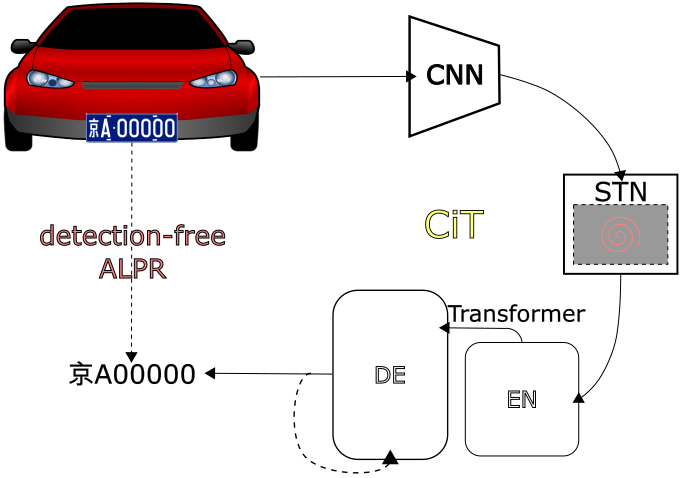

# CiT
Character is also token: Detection-Free Automatic License Plate Recognition Using Vision Transformers. 

fix ALPR with license plate string labels only. 



## Usage
### install requirements
`pip install -r requirements.txt`

### train backbone in LPR task (opt.)
- download CBLPRD dataset and put in CBLdata with csv annoation file
- run pretrain.py script
  - check configs/args_pretrain.yaml. make sure `CBLtrain;CBLvalmodel_name` keys is correct.
  - `python pretrain.py`

### Train 

- download [CCPD](https://github.com/detectRecog/CCPD) and put at `dataset/CCPD`
- generate csv file as exampled `dataset/CCPD/CCPDanno_train.csv`. 
filename,CCPD_path,license_plate is needed columns. 
- modify `configs/args_train.yaml`, make sure CCPD_train,CCPD_val and model_name is what you want.
- `python train.py`

### Eval
run eval.py with `configs/args_eval.yaml`

## Released weight and performance
### CCPD2018
CiT-res18, res50, noSTN, 2STN is released, in which 2STN performed best.
| Method                   | Avg | Base | Cha.  | DB   | FN   | Rotate | Tilt | Wea. |
|--------------------------|-----|------|-------|------|------|--------|------|------|
| CiT-res18 (3.1M,12GFLOPs) | 2.6 | 0.9  | 15.0  | 2.2  | 6.7  | 1.0    | 1.6  | 2.9  |
| CiT-res50 (8.9M,28.2G)    | 2.7 | 0.9  | 14.6  | 2.0  | 7.7  | 1.1    | 1.6  | 3.0  |
| CiT-noSTN (3.1M,12G)      | 2.6 | 0.9  | 15.0  | 2.2  | 6.1  | 1.1    | 1.9  | 3.0  |
| CiT-2STN (3,2M,9.2G)      | 2.4 | 0.8  | 14.0  | 2.0  | 5.5  | 1.0    | 1.7  | 2.6  |

### CCPD2020
| Method       | Avg  | Blur  | Cha.  | DB   | FN   | Rotate | Tilt  | Wea. | Green |
|--------------|------|-------|-------|------|------|--------|-------|------|-------|
| CiT-res50    | 45.9 | 73.1  | 54.8  | 66.3 | 55.0 | 16.2   | 27.8  | 3.1  | 19.5  |
| CiT-noSTN    | 37.0 | 55.2  | 44.3  | 46.9 | 45.3 | 15.0   | 25.4  | 3.0  | 16.2  |
| CiT-res18    | 35.2 | 54.0  | 43.7  | 43.4 | 44.8 | 12.4   | 20.9  | 2.4  | 14.4  |
| CiT-2STN     | 31.5 | 49.3  | 39.4  | 39.1 | 38.3 | 10.7   | 18.6  | 2.0  | 15.0  |

## Citation
```

```